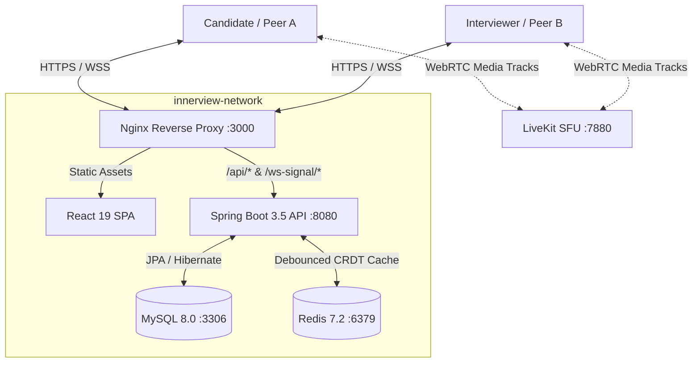
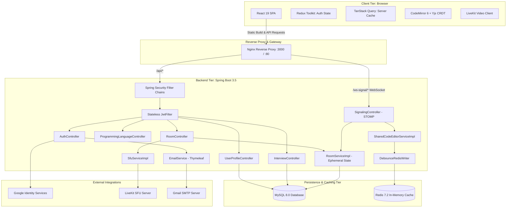
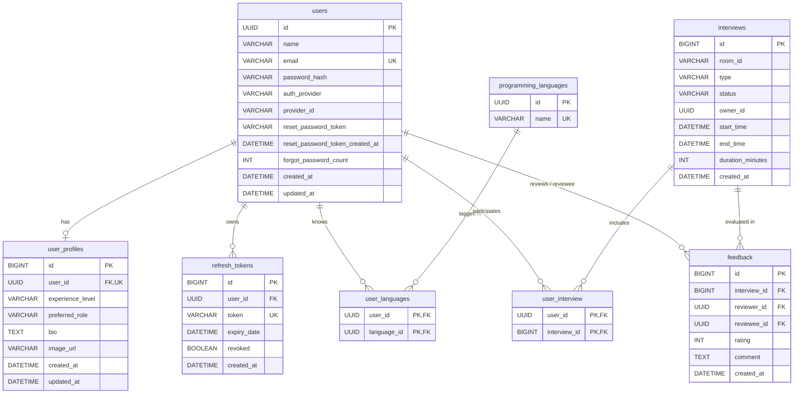
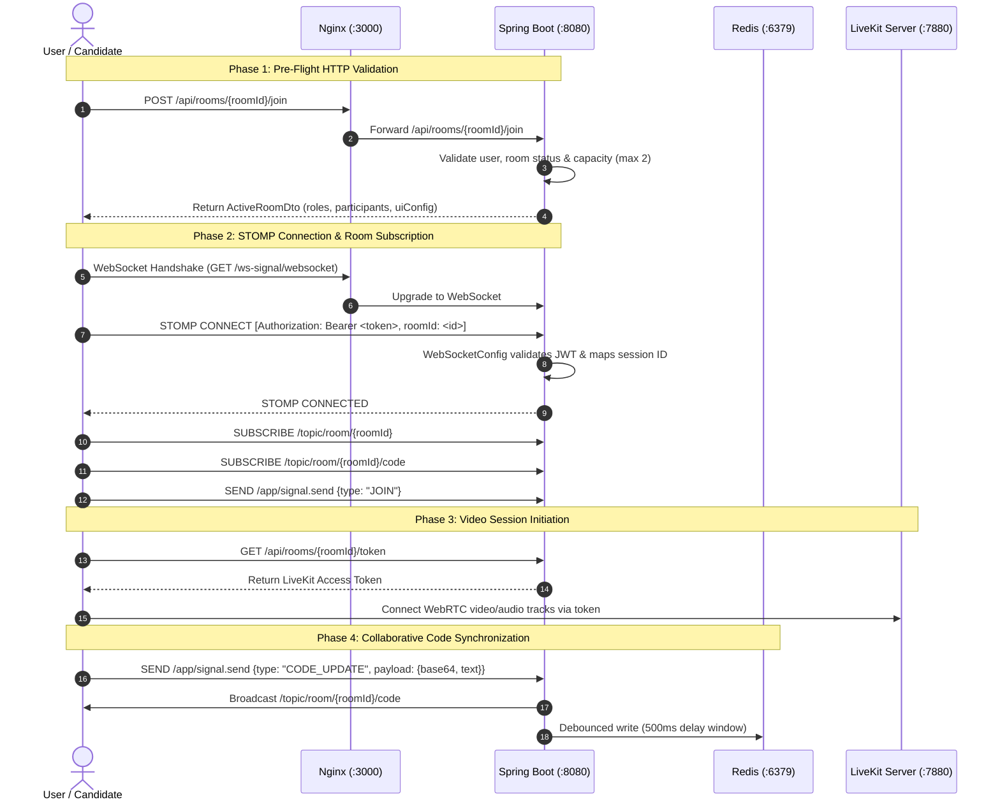

# InnerView — Real-Time Peer-to-Peer Mock Interview Platform

> Conduct realistic technical, system design, and behavioral interviews with synchronized collaborative coding, live video, participant role switching, and structured peer feedback.

[](https://spring.io/projects/spring-boot)
[](https://openjdk.org/)
[](https://react.dev/)
[](https://www.typescriptlang.org/)
[](https://tailwindcss.com/)
[](https://www.mysql.com/)
[](https://redis.io/)
[](https://www.docker.com/)
[](LICENSE)

---

## Executive Summary

**InnerView** is a full-stack, real-time peer-to-peer mock interview platform engineered for software developers preparing for modern technical hiring loops. Preparing for engineering interviews requires more than solving problems in isolation; candidates need hands-on practice articulating architectural decisions under time pressure, writing clean code live with an interviewer watching, and receiving constructive, calibrated critique.

The platform bridges this preparation gap by pairing candidates in dedicated, synchronized interview environments. InnerView dynamically adapts its workspace based on the interview format—delivering an in-browser collaborative code editor powered by CRDTs (Conflict-free Replicated Data Types) for algorithmic coding, an interactive canvas blueprint for system design evaluations, or a conversational setup for behavioral and HR rounds.

InnerView is built with an enterprise-ready architecture featuring a **Java 21 / Spring Boot 3.5** backend, a **React 19 / TypeScript / Vite** Single Page Application, **MySQL 8.0** for relational persistence, **Redis 7.2** for sub-millisecond ephemeral room caching, and **WebSocket / STOMP** alongside **LiveKit SFU** for ultra-low latency audio/video and state synchronization. The entire multi-service topology is containerized and runnable via Docker Compose out of the box.



---

## Key Features (Verified Implementation)

### 1. Authentication & Security
* **Stateless JWT Authentication:** Access tokens signed via HMAC-SHA (`jjwt` 0.11.5) with a 15-minute expiration period.
* **Persistent Refresh Token Rotation:** 7-day cryptographic refresh tokens stored in MySQL, delivered via secure `HttpOnly`, `SameSite=Strict` cookies to mitigate XSS exposure.
* **Google OAuth2 Social Login:** Full OpenID Connect flow integrated with Spring Security's `oauth2Login` and custom `OAuth2SuccessHandler` to create or link Google profiles.
* **Self-Service Password Reset:** Time-limited password reset tokens with transactional dispatch of responsive HTML emails rendered via Thymeleaf templates.
* **Stateless Client Session Synchronization:** Frontend Redux Toolkit store with `localStorage` fallback, expiration tracking, and multi-tab state synchronization.

### 2. Interview Management & Scheduling
* **Instant Interview Rooms:** Immediate room generation with cryptographically unique alphanumeric IDs (`UUID`-derived short identifiers).
* **Scheduled Interviews:** Forward-looking interview bookings configured with start times, duration windows, and dynamic end-time calculation.
* **Categorized Interview Types:** First-class support for `PROBLEM_SOLVING`, `SYSTEM_DESIGN`, `HR`, and `TECHNICAL` formats.
* **Audited Lifecycle States:** Structured progression through `SCHEDULED`, `STARTED`, `COMPLETED`, and `CANCELLED`.
* **Historical Activity Pagination:** Querying past interviews by user ID with status and type filters mapped to JPA pageable results.

### 3. Real-Time Collaborative Room Engine
* **Pre-Flight Room Authorization:** Mandatory HTTP admission check (`POST /api/rooms/{roomId}/join`) enforcing room existence, scheduled time windows, and 2-participant maximum capacity.
* **WebSocket / STOMP Transport:** Bi-directional messaging channel mounted at `/ws-signal` authenticated via JWT Bearer tokens in STOMP `CONNECT` frame headers.
* **Collaborative Code Editor (CRDT Sync):** CodeMirror 6 integrated with `y-codemirror.next` and Yjs. Edits are broadcast via STOMP (`/app/signal.send` with type `CODE_UPDATE`) to `/topic/room/{roomId}/code`.
* **Debounced Redis Snapshot Persistence:** High-frequency code edits update in-memory versions and schedule a 500ms debounced write to Redis (`DebounceRedisWriter`), ensuring late joiners immediately receive full document snapshots without overloading the database.
* **Multi-Language Syntax Highlighting:** Client-side language switching supporting JavaScript, TypeScript, Python, Java, C++, and Plain Text.
* **Role Negotiation & Dynamic Switching:** Default assignment of `INTERVIEWER` to room owners and `INTERVIEWEE` to joiners, with real-time role swapping broadcast to `/topic/room/{roomId}/roles`.
* **Dynamic Workspace Layouts:** Context-aware UI manifests (`RoomUiConfig`) toggling the shared editor, problem statement, and system architecture canvas based on the interview format.

### 4. Audio / Video Streaming
* **LiveKit SFU Integration:** High-quality, low-latency video and audio tracks via `@livekit/components-react` and `livekit-client`.
* **Dynamic SFU Token Issuance:** Backend endpoint (`GET /api/rooms/{roomId}/token`) generating signed LiveKit JWT access tokens with user identities and room join permissions.
* **WebRTC P2P Signaling Fallback:** Dedicated backend signaling relay for `OFFER`, `ANSWER`, and `ICE_CANDIDATE` packets implementing the polite/impolite peer negotiation pattern.

### 5. Developer Profiles & Skills Tracking
* **Profile Customization:** User bios, experience level classifications (`STUDENT`, `FRESH_GRADUATE`, `JUNIOR`, `MID_LEVEL`, `SENIOR`), preferred roles, and avatar URLs.
* **Global Programming Language Catalog:** Shared repository of programming languages (`/api/programming-languages`) created and browsed by platform users.
* **User Language Associations:** Ability for engineers to tag proficiencies to their developer profile (`/api/profile/languages`).

### 6. Peer Feedback & Calibrated Ratings
* **Bi-Directional Review Loop:** Post-interview feedback linking reviewer, reviewee, quantitative rating (1–5 scale), and detailed qualitative comments.
* **Aggregated Performance Metrics:** Optimized SQL native queries calculating average rating metrics per user profile (`GET /api/profile/{userId}/rating`).
* **Paginated Feedback Inboxes:** Separate queries for reviewing feedback received from peers versus feedback given to others.

---

## Architecture & Tech Stack

### High-Level Architecture Diagram



### Technology Breakdown

| Layer | Technology | Version | Purpose |
|---|---|---|---|
| **Frontend Framework** | React | 19.0.0 | Component-driven Single Page Application |
| **Language (Frontend)** | TypeScript | 5.7.0 | Type safety across API responses and components |
| **Build Tool** | Vite | 8.0.0 | Fast HMR and optimized production bundling |
| **Styling** | Tailwind CSS | 4.0.0 | Modern utility-first CSS design system |
| **Client State** | Redux Toolkit | 2.12.0 | Centralized session and authentication state |
| **Server State** | TanStack React Query | 5.102.8 | Asynchronous data fetching, caching, and invalidation |
| **Forms & Validation**| React Hook Form + Zod | 7.88 / 4.6 | Performant schema-driven client-side form validation |
| **Collaborative Editor**| CodeMirror + Yjs | 6.0 / 13.6 | In-browser code editing with CRDT real-time sync |
| **Realtime Messaging**| @stomp/stompjs | 7.3.0 | STOMP protocol over WebSockets for signaling |
| **Video Client** | LiveKit React Components | 2.9.24 | WebRTC video grid, track rendering, and device controls |
| **Icons & Alerts** | Lucide React + Sonner | 1.46 / 2.0 | Consistent iconography and toast notifications |
| **Backend Framework** | Spring Boot | 3.5.7 | Robust enterprise REST and WebSocket microservice |
| **Language (Backend)** | Java (OpenJDK) | 21 (LTS) | Modern Java virtual machine runtime |
| **Security** | Spring Security | 6.5.6 | Stateless JWT authorization, password hashing, OAuth2 |
| **Relational Database**| MySQL | 8.0 | Primary ACID storage for users, profiles, and interviews |
| **ORM / Data Access** | Spring Data JPA / Hibernate | 6.6 | Object-relational mapping and repository abstraction |
| **Caching** | Spring Data Redis (Lettuce) | 7.2 | Room code state persistence and debounce buffering |
| **Video SFU Backend** | LiveKit Server SDK | 0.8.2 | LiveKit room access token generation |
| **Object Mapping** | MapStruct | 1.5.5 | High-performance compile-time bean mapping |
| **Email Templating** | Thymeleaf + Spring Mail | Starter | Responsive HTML transactional emails |
| **Reverse Proxy** | Nginx | 1.27-alpine | Unified same-origin proxy for SPA, API, and WebSockets |
| **Containerization** | Docker + Docker Compose | 3.8 / Compose V2 | Multi-container orchestration |

---

## Database Schema & Data Models

### Entity Relationship Diagram



### Relational Tables

1. **`users`**: Core credentials table. Stores unique email addresses, BCrypt hashed passwords, federated OAuth2 provider IDs (e.g. Google `sub`), reset password tokens, and audit timestamps.
2. **`user_profiles`**: 1-to-1 extension of `users` indexed on `user_id`. Holds bio descriptions, developer experience tiers (`STUDENT` through `SENIOR`), interview role preferences (`INTERVIEWER`, `INTERVIEWEE`, `BOTH`), and profile image URLs.
3. **`interviews`**: Central session records. Captures interview format (`PROBLEM_SOLVING`, `SYSTEM_DESIGN`, `HR`, `TECHNICAL`), lifecycle state (`SCHEDULED`, `STARTED`, `COMPLETED`, `CANCELLED`), room identifier, owner UUID, start time, calculated end time, and duration in minutes.
4. **`user_interview`**: Clustered composite join table `(user_id, interview_id)` establishing many-to-many relationships between users and interviews. Features a secondary index on `interview_id` (`idx_interview_lookup`) ensuring $O(\log N)$ reverse lookups for room participants.
5. **`feedback`**: Structured evaluations submitted after sessions. Enforces integer ratings (1 to 5 stars), written comments, and foreign keys referencing `interview_id`, `reviewer_id`, and `reviewee_id`.
6. **`programming_languages` & `user_languages`**: Language taxonomy (`Java`, `TypeScript`, `Python`, etc.) mapped to users via a composite primary key join table `(user_id, language_id)`.
7. **`refresh_tokens`**: Rotating authentication tokens stored with revocation flags (`revoked`), expiration instants, and user foreign keys.

### In-Memory Ephemeral State Models

To guarantee sub-millisecond coordination during live interview sessions, the backend maintains synchronized in-memory state models inside `RoomServiceImpl`:

* **`ActiveRoom`**: Stores ephemeral room data (`roomId`, `interviewId`, `ownerId`, `uiConfig`, `participants` map, `activeParticipants` counter, `createdAt`, `lastActiveAt`). Rooms automatically clean up after 10 minutes of inactivity.
* **`RoomParticipant`**: Represents an active socket connection (`userId`, `roomId`, `role`, `status`, `sessionId`, `joinedAt`).
* **`RoomUiConfig`**: Governs component rendering dynamically based on interview type:
  - `HR`: Shows problem/question prompt; hides code editor and canvas.
  - `PROBLEM_SOLVING`: Shows problem statement and shared collaborative code editor.
  - `SYSTEM_DESIGN`: Shows problem statement and architecture canvas.

### Redis Caching & Debounce Persistence Pattern

High-frequency collaborative typing would overwhelm relational databases. InnerView solves this with a **Debounce Redis Write Pipeline**:
1. Every keystroke is emitted via STOMP `CODE_UPDATE` with a base64-encoded CRDT vector and plain text string.
2. The server broadcasts the update to room peers immediately for zero UI lag.
3. Simultaneously, `DebounceRedisWriter` schedules a delayed write (500ms debounce window). Subsequent keystrokes cancel pending writes and schedule the latest document version.
4. On timeout or explicit compile flush, the consolidated vector is saved to Redis key `room:{roomId}:code`.
5. When a late participant joins, `SharedCodeEditorServiceImpl.getCodeSnapshot` retrieves the state directly from Redis.

---

## API Reference

All REST endpoints are rooted at `/api`. Responses are serialized as JSON.

### 1. Authentication (`/api/auth`)

| Method | Endpoint | Auth | Description | Request Body / Parameters | Response |
|---|---|---|---|---|---|
| `POST` | `/api/auth/register` | Public | Registers a new user account | `{"name", "email", "password"}` | `201 Created` with `RegisterResponse` |
| `POST` | `/api/auth/login` | Public | Authenticates credentials | `{"email", "password"}` | `200 OK` with user JSON, `Authorization: Bearer <jwt>`, and `Set-Cookie: refresh_token=...` |
| `POST` | `/api/auth/refresh` | Public | Rotates expired access token | `{"refreshToken": "..."}` | `200 OK` with `{"accessToken", "refreshToken"}` |
| `POST` | `/api/auth/logout` | User | Revokes refresh token & clears cookie | Cookie `refresh_token` | `200 OK` + expired `Set-Cookie` |
| `POST` | `/api/auth/forgot-password` | Public | Initiates password reset email | `{"email": "..."}` | `200 OK` with status message |
| `POST` | `/api/auth/reset-password` | Public | Completes password reset | `{"token", "newPassword", "confirmationPassword"}` | `200 OK` with confirmation message |
| `GET` | `/api/auth/google/login` | Public | Redirects to Google OAuth2 flow | None | `302 Found` to `/oauth2/authorization/google` |

### 2. User Profiles (`/api/profile`)

| Method | Endpoint | Auth | Description | Request Body / Parameters | Response |
|---|---|---|---|---|---|
| `GET` | `/api/profile` | User | Retrieves the authenticated user's profile | None | `200 OK` with `UserProfileResponse` (or `404`) |
| `POST` | `/api/profile` | User | Creates the initial user profile | `{"experienceLevel", "preferredRole", "bio", "imageUrl"}` | `201 Created` with `UserProfileResponse` |
| `PUT` | `/api/profile` | User | Updates an existing profile | `{"experienceLevel", "preferredRole", "bio", "imageUrl"}` | `200 OK` with `UserProfileResponse` |
| `DELETE` | `/api/profile` | User | Deletes the user profile | None | `200 OK` |
| `GET` | `/api/profile/{userId}/rating` | User | Retrieves the average rating for a user | Path: `userId` (UUID) | `200 OK` with `{"userId", "averageRating"}` |
| `GET` | `/api/profile/{userId}/interviews`| User | Paginated interview history | Query: `status`, `type`, `page`, `limit` | `200 OK` with `Page<InterviewHistoryDto>` |
| `GET` | `/api/profile/{userId}/feedback` | User | Paginated received feedback | Query: `rating`, `page`, `limit` | `200 OK` with `Page<FeedbackDto>` |
| `GET` | `/api/profile/{userId}/feedback/given`| User | Paginated given feedback | Query: `page`, `limit` | `200 OK` with `Page<FeedbackDto>` |

### 3. User & Programming Languages

| Method | Endpoint | Auth | Description | Request Body / Parameters | Response |
|---|---|---|---|---|---|
| `GET` | `/api/programming-languages` | User | Global catalog of available languages | None | `200 OK` with `List<ProgrammingLanguageDto>` |
| `POST` | `/api/programming-languages` | User | Adds a language to the global catalog | `{"name": "Rust"}` | `201 Created` with `ProgrammingLanguageDto` |
| `GET` | `/api/profile/languages` | User | List languages assigned to user profile | None | `200 OK` with `List<ProgrammingLanguageDto>` |
| `POST` | `/api/profile/languages` | User | Associates a language with user profile| `{"language_id": "UUID"}` | `201 Created` with `MessageResponse` |
| `DELETE`| `/api/profile/languages/{id}` | User | Removes language from user profile | Path: `id` (UUID) | `200 OK` with `MessageResponse` |

### 4. Interviews (`/api/interviews`)

| Method | Endpoint | Auth | Description | Request Body / Parameters | Response |
|---|---|---|---|---|---|
| `POST` | `/api/interviews/instant` | User | Creates and starts an instant room | `{"interviewType": "PROBLEM_SOLVING"}` | `200 OK` with `{"roomId", "roomLink"}` |
| `POST` | `/api/interviews/scheduled` | User | Books a scheduled interview session | `{"interviewType", "startTime": "ISO-8601"}` | `200 OK` with `{"roomId", "roomLink"}` |

### 5. Rooms (`/api/rooms`)

| Method | Endpoint | Auth | Description | Request Body / Parameters | Response |
|---|---|---|---|---|---|
| `POST` | `/api/rooms/{roomId}/join` | User | Pre-flight validation & room setup | Path: `roomId` | `200 OK` with `ActiveRoomDto` |
| `POST` | `/api/rooms/{roomId}/leave` | User | Graceful exit notification | Path: `roomId` | `200 OK` |
| `GET` | `/api/rooms/{roomId}/token` | User | Generates LiveKit SFU video JWT | Path: `roomId` | `200 OK` with `{"token": "..."}` |

### 6. WebSocket STOMP Protocol Specification

The WebSocket endpoint is mounted at `/ws-signal` (SockJS transport fallback at `/ws-signal/websocket`).

* **Connection Handshake:**
  - Transport: STOMP over WebSocket
  - Native CONNECT Headers:
    - `Authorization: Bearer <jwt-access-token>`
    - `roomId: <target-room-id>`
* **Client Send Destination:** `/app/signal.send`
  Payload format:
  ```json
  {
    "type": "JOIN | JOIN_FEATURE | ROLE_UPDATE | CODE_UPDATE | COMPILE_CODE | OFFER | ANSWER | ICE_CANDIDATE",
    "payload": { ... }
  }
  ```
* **Server Broadcast Channels:**
  - `/topic/room/{roomId}`: Participant join/leave lifecycle events & WebRTC signaling
  - `/topic/room/{roomId}/code`: Synchronized code changes and editor snapshots
  - `/topic/room/{roomId}/roles`: Role promotion/demotion updates
  - `/topic/room/{roomId}/ui-available`: Dynamic panel activations (e.g. `SHARED_EDITOR`)

---

## Real-Time Collaboration Deep Dive



---

## Project Structure

```
Innerview/
├── docker-compose.yml             # Orchestration: frontend, backend, mysql, redis
├── .env.example                   # Baseline environment variable template
├── DOCKER.md                      # Detailed Docker operations runbook
├── LICENSE                        # Project MIT License
├── README.md                      # Primary project documentation
│
├── frontend/                      # React 19 Single Page Application
│   ├── Dockerfile                 # Multi-stage container build (Node 22 -> Nginx 1.27)
│   ├── nginx.conf                 # Reverse proxy & SPA fallback configuration
│   ├── package.json               # Node dependencies & project scripts
│   ├── vite.config.ts             # Vite configuration with Tailwind CSS plugin
│   └── src/
│       ├── app/                   # App root: Router, Store, Providers
│       ├── components/            # Reusable UI library (forms, layout, modals, tables)
│       │   ├── common/            # Button, Input, Modal, Badge, Spinner
│       │   ├── feedback/          # EmptyState, ErrorScreen, Loading states
│       │   └── layout/            # AppLayout, AuthLayout, Navbar, Sidebar
│       ├── constants/             # Configuration & environment helpers
│       ├── features/              # Modular domain feature slices
│       │   ├── auth/              # Login, register, password reset, session utils
│       │   ├── dashboard/         # User dashboard, metrics, quick actions
│       │   ├── interviews/        # Instant & scheduled interview creation, listings
│       │   ├── languages/         # Programming language management & catalogs
│       │   ├── profile/           # Developer profile management & ratings
│       │   ├── feedback/          # Post-interview feedback viewing
│       │   └── room/              # Live interview room, CodeMirror 6, LiveKit video
│       ├── lib/                   # Axios client, QueryClient, error handlers
│       ├── routes/                # Route definitions & authentication guards
│       └── types/                 # Shared TypeScript interfaces
│
└── services/
    └── spring-boot/               # Core Spring Boot REST & Realtime Service
        ├── Dockerfile             # Multi-stage build (JDK 21 compile -> JRE 21 runtime)
        ├── pom.xml                # Maven project definition & dependencies
        └── src/
            ├── main/
            │   ├── java/com/innerview/spring/
            │   │   ├── SpringServicesApplication.java
            │   │   ├── controller/    # REST API endpoints & STOMP controllers
            │   │   ├── core/          # Security filters, JWT utils, WebSocket configs
            │   │   │   ├── config/    # SecurityConfig, WebSocketConfig, AsyncConfig
            │   │   │   ├── handler/   # OAuth2SuccessHandler
            │   │   │   └── util/      # JwtUtil, RoomUtil
            │   │   ├── dto/           # Request/response records & DTO classes
            │   │   ├── entity/        # JPA Entities (User, Interview, Feedback, etc.)
            │   │   ├── enums/         # Domain enums (InterviewStatus, InterviewType, etc.)
            │   │   ├── exception/     # Centralized exception handlers & exceptions
            │   │   ├── mapper/        # MapStruct mapping interfaces
            │   │   ├── repository/    # Spring Data JPA repositories
            │   │   ├── scheduler/     # Background cron tasks (RefreshTokenCleanup)
            │   │   └── service/       # Domain business logic & implementations
            │   │       ├── impl/      # RoomServiceImpl, SharedCodeEditorServiceImpl, etc.
            │   │       └── redis/     # DebounceRedisWriter, RedisPersistenceService
            │   └── resources/
            │       ├── application.yml # Main Spring configuration file
            │       └── templates/     # Thymeleaf email templates (reset-password.html)
            └── test/                  # MockMvc tests, BCrypt tests, unit test suite
```

---

## Environment Variables & Configuration

### Root / Docker Compose Configuration (`.env`)

| Variable | Default Value | Required | Description |
|---|---|---|---|
| `FRONTEND_PORT` | `3000` | No | Host port mapped to the Nginx frontend reverse proxy |
| `BACKEND_PORT` | `8080` | No | Host port mapped directly to the Spring Boot container |
| `FRONTEND_URL` | `http://localhost:3000` | Yes | Browser-facing URL used for backend CORS and OAuth redirects |
| `DB_PORT` | `3306` | No | Host port mapped to MySQL |
| `DB_USERNAME` | `innerview` | Yes | Database user for the Spring application |
| `DB_PASSWORD` | `innerview_pass` | Yes | Database user password |
| `DB_ROOT_PASSWORD`| `root_pass` | Yes | MySQL administrative root password |
| `REDIS_PORT` | `6379` | No | Host port mapped to Redis |
| `JWT_SECRET` | *(64-char dev key)* | Yes | Cryptographic secret for signing HMAC-SHA JWT access tokens |
| `GOOGLE_CLIENT_ID` | `dummy-client-id` | Optional | Google Cloud Console OAuth 2.0 Client ID |
| `GOOGLE_CLIENT_SECRET`| `dummy-client-secret`| Optional | Google Cloud Console OAuth 2.0 Client Secret |
| `MAIL_USERNAME` | *(empty)* | Optional | Gmail address used to dispatch password reset emails |
| `MAIL_PASSWORD` | *(empty)* | Optional | Gmail App Password (16 characters) for SMTP auth |
| `VITE_LIVEKIT_URL` | `ws://localhost:7880` | Optional | WebSocket URL to LiveKit SFU (built into Docker Compose) |

### Frontend Variables (`frontend/.env`)

| Variable | Default Value | Description |
|---|---|---|
| `VITE_API_BASE_URL` | `""` (empty) | Base API URL. In Docker or production, leave empty so calls use same-origin `/api` via Nginx |
| `VITE_LIVEKIT_URL` | `ws://localhost:7880` | WebSocket URL to LiveKit SFU. Connects browser to live video/audio calls |

---

## Getting Started & Local Setup

### Option A: Quick Start with Docker Compose (Recommended)

Docker Compose automatically configures, links, and runs the entire stack—Frontend, Backend, LiveKit SFU, MySQL, and Redis.

#### 1. Clone the repository
```bash
git clone https://github.com/innerview-platform/innerview.git
cd innerview
```

#### 2. Create the `.env` file
```bash
cp .env.example .env
```
*(The default values in `.env.example` are pre-configured to work immediately without adjustments.)*

#### 3. Start all services
```bash
docker compose up --build -d
```

#### 4. Verify system health
```bash
# Check container statuses
docker compose ps

# Confirm the backend passed health checks
curl -f http://localhost:8080/actuator/health
```

#### 5. Open in browser
Access the application at [http://localhost:3000](http://localhost:3000).

---

### Option B: Manual Local Development Setup

If you prefer developing outside of containers, follow these steps to run each service natively.

#### Prerequisites
* **Node.js**: `v20+` or `v22+` with `pnpm` installed (`corepack enable pnpm`)
* **Java SDK**: `OpenJDK 21` or `Eclipse Temurin 21`
* **MySQL**: `8.0` running locally on port `3306`
* **Redis**: `7.0+` running locally on port `6379`

#### 1. Setup MySQL Database
Connect to your local MySQL instance and create the database and user:
```sql
CREATE DATABASE innerview CHARACTER SET utf8mb4 COLLATE utf8mb4_unicode_ci;
CREATE USER 'innerview'@'localhost' IDENTIFIED BY 'innerview_pass';
GRANT ALL PRIVILEGES ON innerview.* TO 'innerview'@'localhost';
FLUSH PRIVILEGES;
```

#### 2. Start the Spring Boot Backend
Navigate to the backend directory and run:
```bash
cd services/spring-boot

# Set required environment variables for local execution
export DB_URL="jdbc:mysql://localhost:3306/innerview?useSSL=false&allowPublicKeyRetrieval=true&serverTimezone=UTC"
export DB_USERNAME="innerview"
export DB_PASSWORD="innerview_pass"
export JWT_SECRET="super-secret-jwt-key-for-dev-only-change-in-production"
export FRONTEND_URL="http://localhost:3000"
export GOOGLE_CLIENT_ID="dummy-client-id"
export GOOGLE_CLIENT_SECRET="dummy-client-secret"

# Run using the Maven wrapper
./mvnw spring-boot:run
```
The backend will initialize Hibernate DDL tables automatically and start listening on port `8080`.

#### 3. Start the React Frontend
Open a new terminal tab and start the frontend development server:
```bash
cd frontend

# Install dependencies
pnpm install

# Start Vite dev server (proxies /api to localhost:8080)
pnpm dev
```
Open [http://localhost:3000](http://localhost:3000) in your browser.

---

## Background Jobs & Schedulers

* **`RefreshTokenCleanupScheduler`**:
  - Implementation: `com.innerview.spring.scheduler.RefreshTokenCleanupScheduler`
  - Schedule: Runs daily at 3:00 AM (`@Scheduled(cron = "0 0 3 * * *")`).
  - Responsibility: Deletes revoked or expired tokens from the `refresh_tokens` table to prevent table bloat.
* **`RoomServiceImpl.cleanupEmptyRooms`**:
  - Implementation: `com.innerview.spring.service.impl.RoomServiceImpl`
  - Schedule: Runs every 5 minutes (`@Scheduled(fixedDelay = 300000)`).
  - Responsibility: Evicts active rooms from memory if they have 0 active participants and have been idle for more than 10 minutes.

---

## Testing & Quality Assurance

### Backend Tests
The Spring Boot test suite exercises API integration, security filtering, and password cryptography:
```bash
cd services/spring-boot
./mvnw test
```
* **`AuthControllerIntegrationTest`**: Tests registration, login authentication, token refresh, and cookie assertions via Spring MockMvc.
* **`UserProfileControllerTest`**: Validates profile creation, profile retrieval, rating queries, and validation failures.
* **`BcryptSaltingTest`**: Verifies password hashing salt generation and cryptographic verification.
* **`OAuth2SuccessHandlerTest`**: Asserts correct OAuth2 token generation and redirection behavior.

### Frontend Verification
```bash
cd frontend

# TypeScript strict type check
pnpm typecheck

# Production build validation
pnpm build
```

---

## Known Limitations & Architecture Notes

To provide complete technical transparency for contributors and evaluators, the following architectural details reflect the current codebase implementation:

1. **System Design Canvas**: The `SYSTEM_DESIGN` interview type toggles `showSystemCanvas` in `RoomUiConfig`. The whiteboard rendering component is stubbed awaiting full `tldraw` integration.
2. **Code Execution Sandbox**: The `COMPILE_CODE` STOMP signal flushes collaborative code changes to Redis and logs the event to the server. Integration with an isolated remote execution engine (e.g. Judge0 or Piston) is planned for future iterations.
3. **LiveKit Video SFU**: Video streaming utilizes the LiveKit WebRTC client. A LiveKit server running in development mode is bundled directly into `docker-compose.yml` (`ws://localhost:7880`), enabling video/audio calls out of the box. For standalone local frontend dev (`pnpm dev`), ensure LiveKit is running locally or via Docker (`docker compose up livekit -d`).
4. **Email Dispatch**: Sending password reset emails requires valid Gmail SMTP app credentials in `.env`. If credentials are omitted, the backend handles the request without failing, but email delivery is bypassed.
5. **CORS & Origin Coupling**: In production, the Nginx reverse proxy ensures the frontend and backend share the same browser origin (`http://localhost:3000`). This ensures `HttpOnly` refresh token cookies and `Authorization` headers are never stripped or blocked by cross-origin browser policies.

---

## License

This project is licensed under the terms of the [MIT License](LICENSE).
Copyright (c) 2026 innerview-platform.
